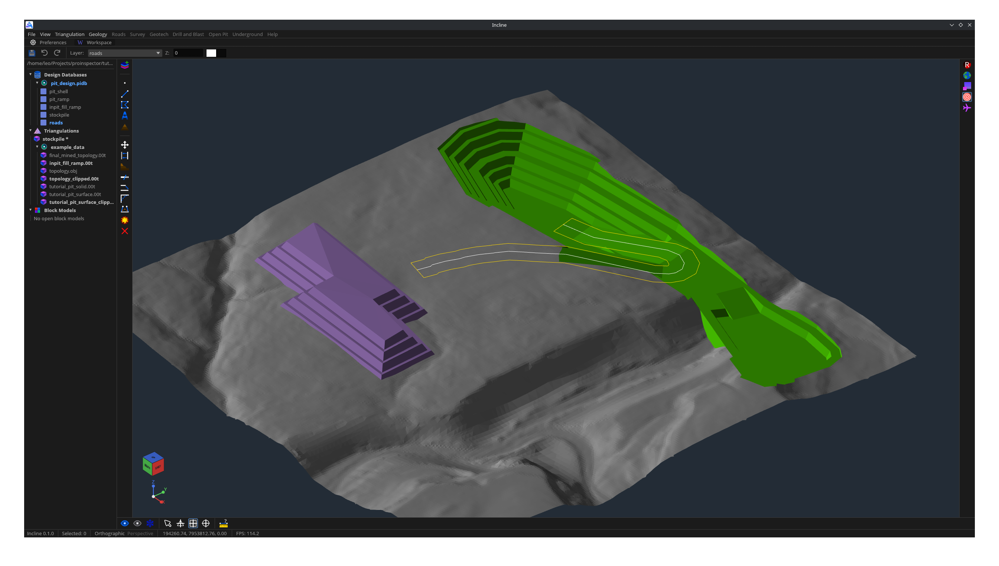

# Incline
Incline is a free source-available mine design project to liberate the mining industrys from expensive closed mining CAD software.

Cross-platform, lightweight, and built for mining professionals. Incline is free and open for everyone - aspiring students, professionals, and hobbists.



## Status

Incline is in early development. Expect missing or incomplete features as we continue to polish for a v1.0 release.

We're working hard to bring stability and features over the coming months. However, please excerise caution during the early access - back up production data and verify exports before operational use.

## Features

- Compatible with Vulcan and Deswik file formats
- Layer-based editing for points, lines, polylines, polygons, text, roads, colours, visibility, and fill styles.
- Mine-design tools including offsetting, auto-bench style offsets, chamfering, line relimiting, fusing lines into polygons, polygon explosion, bezier shaping, and road creation.
- DXF import/export for exchanging design linework with other CAD and mine planning tools.
- Triangulation loading, viewing, saving, and export.
- Block model viewing and filtering, with support for .bmf files.
- Support for .00t, OBJ, STL, and PLY triangulation files.
- Cross-platform desktop target: Windows, Linux, and macOS.

## Getting Started

Install Rust & Cargo via rustup if you have not already done so.

Clone and run
```sh
cargo run --release
```

It is recomended you complete the [tutorial](tutorial/tutorial.md). 
It covers the basics of using Incline for mine design.

## Contributing

Contributions are welcome. Start with [CONTRIBUTING.md](CONTRIBUTING), then look at [docs/good-first-commits.md](docs/good-first-commits.md) for approachable areas.

Before submitting changes, run:

```sh
cargo fmt
cargo check
cargo clippy
```

## License

Incline is licensed under the PolyForm Perimeter License 1.0.1. See [LICENSE](LICENSE.md) for the full terms.

Commercial licenses and permissions outside those terms are available from the copyright holders, please contact `leotimmins1974@gmail.com`.

## Maintainers

Two Western Australian mining engineer brothers - Lucas and Leo Timmins:
- **Leo Timmins** github: *leotimmins1974* email: *leotimmins1974@gmail.com*
- **Lucas Timmins** github: *trimental* email: *timmins.s.lucas@gmail.com*
